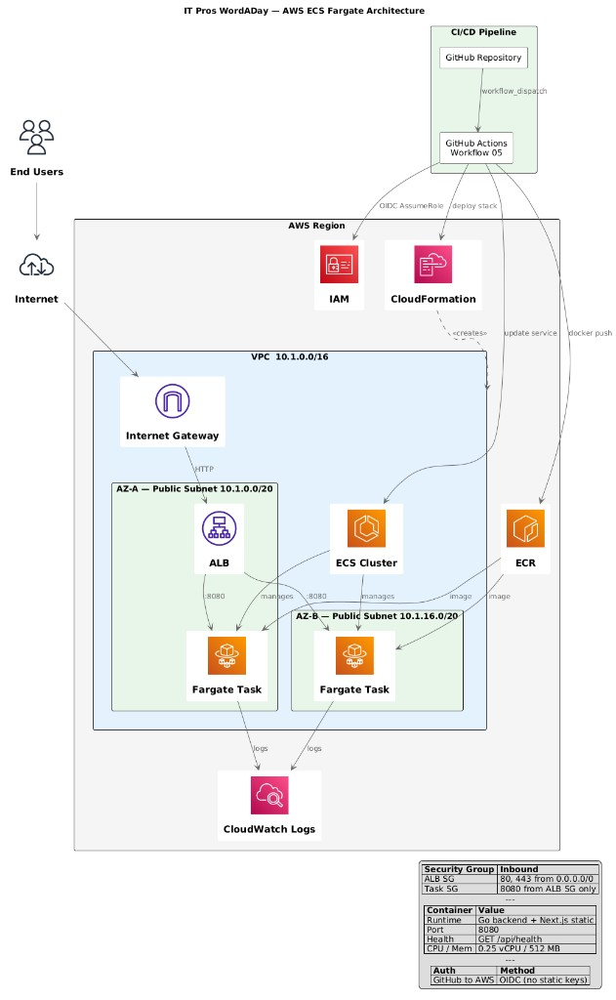

# Architecture Diagrams

## AWS ECS Fargate Deployment

> Diagram source: [aws-ecs-fargate-architecture.puml](./aws-ecs-fargate-architecture.puml) | Rendered: [aws-ecs-fargate-architecture.png](./aws-ecs-fargate-architecture.png)

### What This Diagram Shows

- **CI/CD Pipeline**: GitHub Actions (Workflow 05) → OIDC auth → ECR push → ECS deploy
- **Networking**: VPC with 2 public subnets across 2 Availability Zones, Internet Gateway
- **Load Balancing**: Application Load Balancer (HTTP :80) → Fargate tasks (:8080)
- **Compute**: ECS Fargate tasks running the Go backend + Next.js static frontend
- **Observability**: CloudWatch Logs via awslogs driver
- **Infrastructure as Code**: CloudFormation manages all resources
